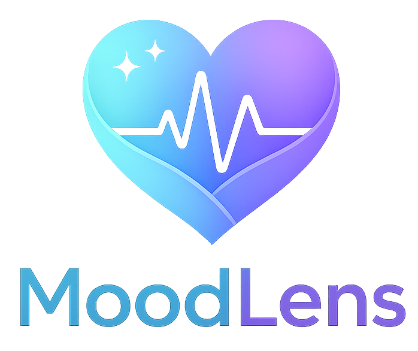
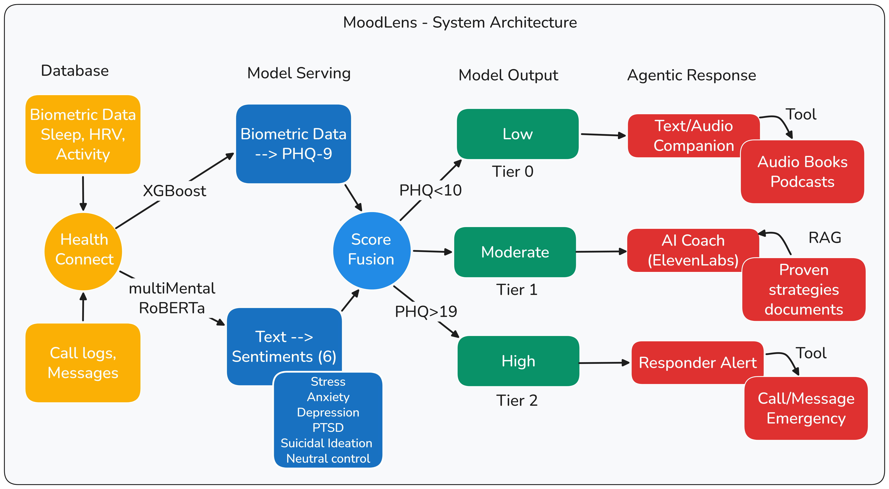

# MoodLens

<p align="center">
  
</p>

<p align="center">
  <strong>Early mental health risk detection and supportive intervention planning from wearable + conversational signals.</strong>
</p>

<p align="center">
  
  
  
</p>

## Executive Summary
MoodLens is an AI-assisted prevention and support application that helps identify mental health risk patterns early using passive digital biomarkers and conversational signals. It combines model inference, tiered safety logic, and guided daily interventions into a single user-facing experience.

MoodLens is designed for early support, not diagnosis.

## What MoodLens Does
- Ingests multimodal inputs (wearable-style telemetry, behavioral proxies, and user conversation).
- Scores risk patterns with Databricks-hosted NLP and PHQ models.
- Applies a safety-first ensemble policy with escalation overrides.
- Produces a personalized daily action plan based on burden categories.
- Routes users to tiered support pathways, including crisis resources when needed.

## Product Experience
Primary app routes:

| Route | Purpose |
| --- | --- |
| `/` | Daily check-in and quick actions |
| `/chat` | Voice/text support conversation with adaptive risk signals |
| `/safety` | Safety protocol and escalation resources |
| `/stats` | Trend and explainability-oriented story view |
| `/plan` | Adaptive check-in and personalized care plan |

Additional internal routes include `/data`, `/impact`, `/viz-lab`, and `/dev`.

## System Architecture
MoodLens follows a decision pipeline built for explainability and safety:

1. Collect signals.
2. Score NLP + PHQ models.
3. Apply ensemble decision logic and safety overrides.
4. Generate intervention and escalation recommendations.
5. Present user actions and explainability context.



## Key Capabilities
- Adaptive screening engine (`src/screening/adaptiveEngine.js`).
- Tiered risk logic with critical safety override handling.
- Explainability summaries for key risk contributors.
- Personal care plan generation from dominant burden categories.
- Exportable structured snapshots for analysis and submission workflows.
- Optional voice conversation via ElevenLabs with risk-tier-aware agent routing.

## Tech Stack
- Frontend: React 19, React Router, Vite.
- Visualization: Recharts.
- AI services: Databricks serving endpoints, ElevenLabs conversational + TTS APIs.
- Tooling: ESLint, Node scripts for docs and submission assets.

## Quick Start
### 1. Prerequisites
- Node.js 20+ (recommended).
- npm 10+.

### 2. Install
```bash
npm install
```

### 3. Configure environment
Create a `.env` file in the project root:

```bash
VITE_DATABRICKS_TOKEN=...
VITE_ELEVENLABS_API_KEY=...
VITE_ELEVENLABS_VOICE_ID=...
VITE_ELEVENLABS_COMPANION_AGENT_ID=...
VITE_ELEVENLABS_TEXTCOMPANION_AGENT_ID=...
VITE_ELEVENLABS_COACH_AGENT_ID=...
VITE_ELEVENLABS_RESPONDER_AGENT_ID=...
```

### 4. Run locally
```bash
npm run dev
```

Open the local Vite URL shown in your terminal.

## Available Scripts
```bash
npm run dev                 # Start development server
npm run build               # Production build
npm run preview             # Preview production build locally
npm run lint                # Run ESLint
npm run docs:sphinx         # Generate Sphinx-oriented docs
npm run submission:generate # Build submission kit assets
```

## Repository Layout
```text
main/
├── docs/                   # Submission + technical documentation
├── images/                 # Brand and architecture assets
├── ml/                     # Notebook + synthetic dataset
├── public/                 # Static public assets
├── scripts/                # Automation scripts for docs/submission
├── src/
│   ├── components/         # Shared UI components
│   ├── pages/              # Route-level pages
│   ├── screening/          # Adaptive screening engine
│   ├── growth/             # Engagement logic
│   └── vectorai/           # Vector payload utilities
├── REQUIREMENTS.md
└── README.md
```

## Safety and Ethical Guardrails
- MoodLens is a prevention and support assistant, not a diagnostic tool.
- Escalation pathways are explicit and user-visible.
- Crisis guidance is surfaced for high-risk safety states.
- Human-in-the-loop support is part of the operating model.

## Documentation
- Product requirements: `REQUIREMENTS.md`
- Feature roadmap: `docs/IMPORTANT_FEATURES.md`
- Submission resources: `docs/submission/`
- Integration notes: `docs/VECTORAI_INTEGRATION.md`, `docs/DATABRICKS_UN_PLAYBOOK.md`, `docs/SPHINX_EXPLAINABILITY.md`

## Disclaimer
MoodLens does not replace licensed mental-health professionals or emergency services. If someone is in immediate danger, contact local emergency services or a crisis hotline right away.
